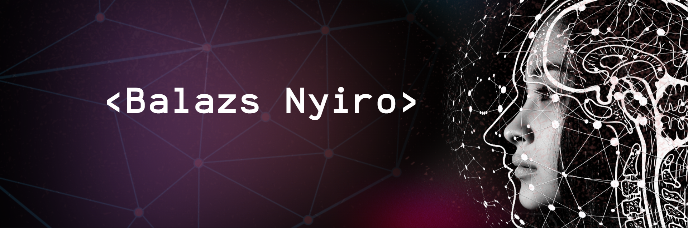

Hey there 👋

I’m Balazs. I am passionate about developing new solutions to challenging complex problems through exploration, particularly through a multidisciplinary approach. I am particularly keen to understand biomedical processes and neurological systems to apply the knowledge gained from these fields. 
In the future, I would like to transfer my knowledge of machine learning, computer vision and data science from my studies to real-life projects by combining it with my knowledge of neuroscience and biotechnology.

For more information about me and to get in touch:    

## 📌 My latest projects

 

 
 
